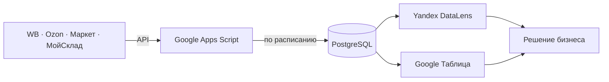

**Аналитик данных · BI · оцифровка процессов на маркетплейсах**

Собираю данные из кабинетов, считаю метрики и отдаю дашборд или таблицу, которой пользуются.  
WB · Ozon · Яндекс Маркет · МойСклад · Google Apps Script  
Курс: аналитик данных, [Яндекс Практикум](https://practicum.yandex.ru/data-analyst/)

 

 

---

## Навыки

<table>
<tr>
<td width="33%" valign="top">

**Данные**  
SQL-запросы, витрины в PostgreSQL и ClickHouse, предобработка в Python / Pandas

</td>
<td width="33%" valign="top">

**Выводы для бизнеса**  
Метрики, дерево метрик, юнит-экономика, гипотезы, A/B-тесты и рекомендации

</td>
<td width="33%" valign="top">

**Отчёт и процесс**  
Дашборды в DataLens, выгрузки через API и Google Apps Script, контур кабинет → хранилище → отчёт

</td>
</tr>
</table>

---

## Проекты

<table>
<tr>
<td width="50%" valign="top">

### [Дашборд по данным конференции TED](https://github.com/shcherbakc/TED_conferences)

Темы, хронометраж, реакция зала и рекомендации организатору.

</td>
<td width="50%" valign="top">

### [Анализ объявлений о продаже жилой недвижимости](https://github.com/shcherbakc/project_real_estate_dashboard)

Цены, срок экспозиции и сезонность по СПб и Ленобласти.

</td>
</tr>
<tr>
<td width="50%" valign="top">

### Предобработка данных онлайн‑игры в Python

Чистка и подготовка данных игры для дальнейшего анализа.

</td>
<td width="50%" valign="top">

### Анализ активности пользователей Яндекс Книг

DAU и активность в SQL, проверка гипотез и разбор A/B в Python.

</td>
</tr>
<tr>
<td width="50%" valign="top">

### Дашборд на основе данных Яндекс Афиши

Метрики, тренды, гипотезы и рекомендации по данным Афиши.

</td>
<td width="50%" valign="top">

### [Пайплайн аналитики маркетплейса](https://github.com/shcherbakc/marketplace-data-pipeline)

API → PostgreSQL → DataLens / Google Таблица. Скрипты выгрузки под запрос клиента.

</td>
</tr>
</table>

---

## Инструменты

| Данные | BI и визуализация | Статистика и продукт | Автоматизация |
|:---|:---|:---|:---|
| SQL | Yandex DataLens | A/B-тесты | Google Apps Script |
| PostgreSQL | Google Таблицы | T-тест · Z-тест | Airflow |
| ClickHouse | Python · Pandas | Манн — Уитни | API WB / Ozon / Маркет |
| PySpark | Matplotlib | k-means · модель оттока | МойСклад |

Юнит-экономика · дерево метрик

---

## Как собираю контур данных

---

## Активность

 

 

---

## Контакты

Открыт к ролям **аналитика данных**, **BI-аналитика** и задачам по **оцифровке бизнес-процессов**.

